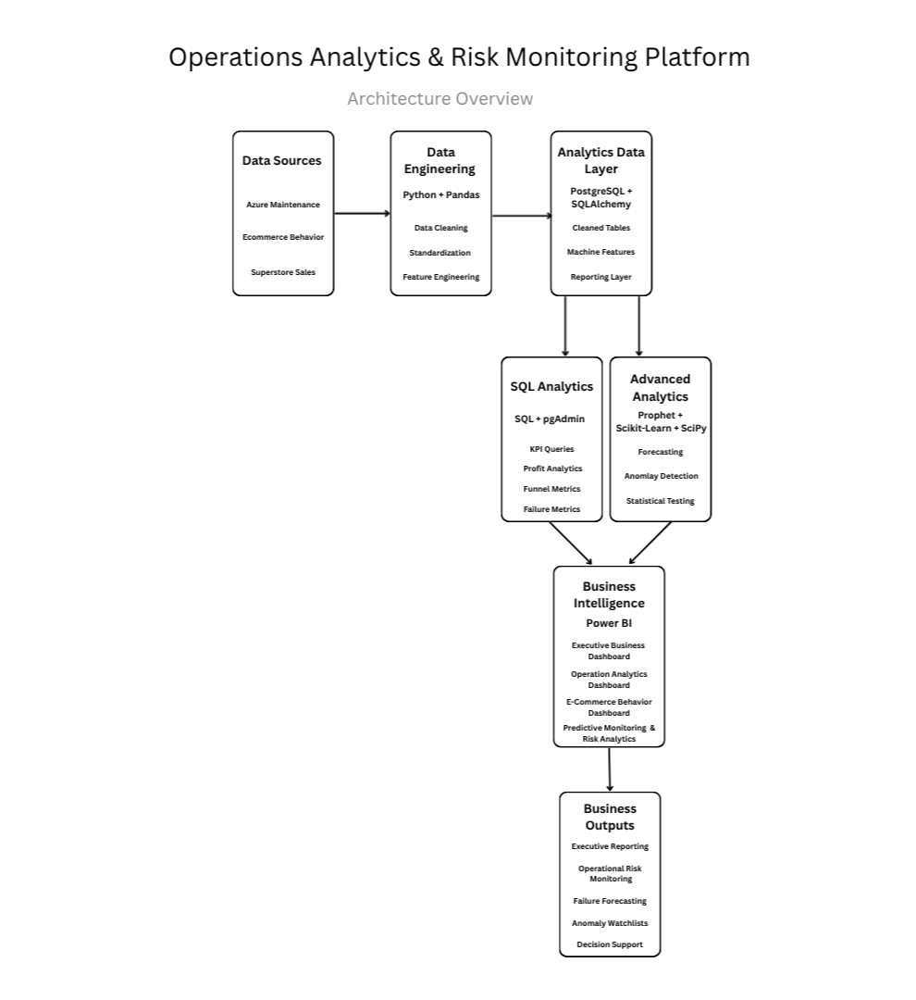
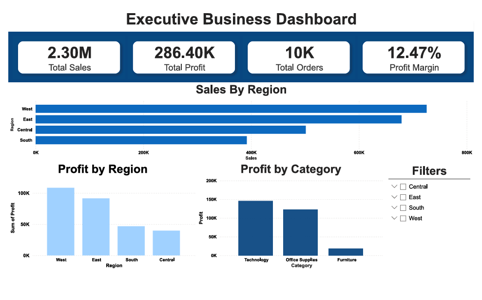
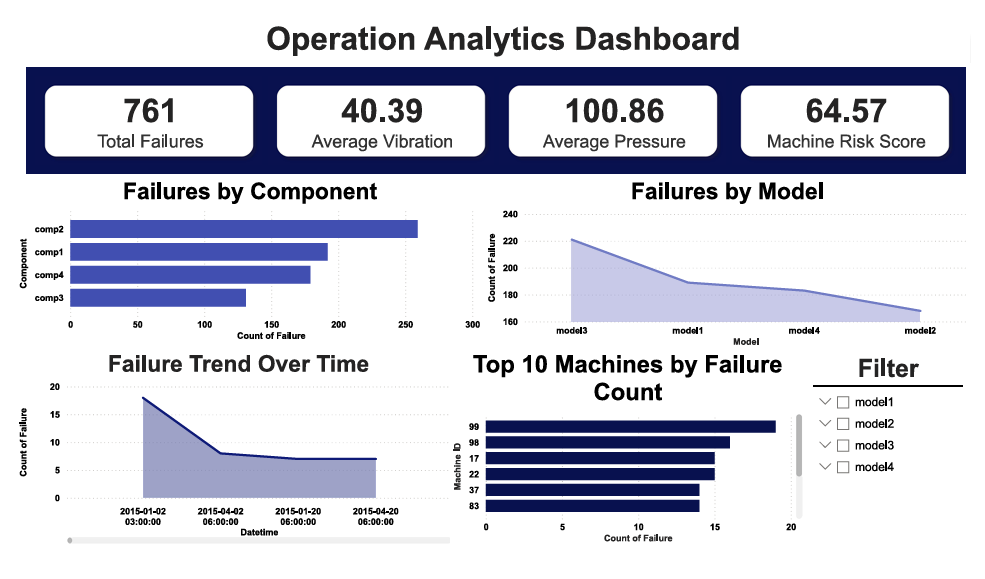
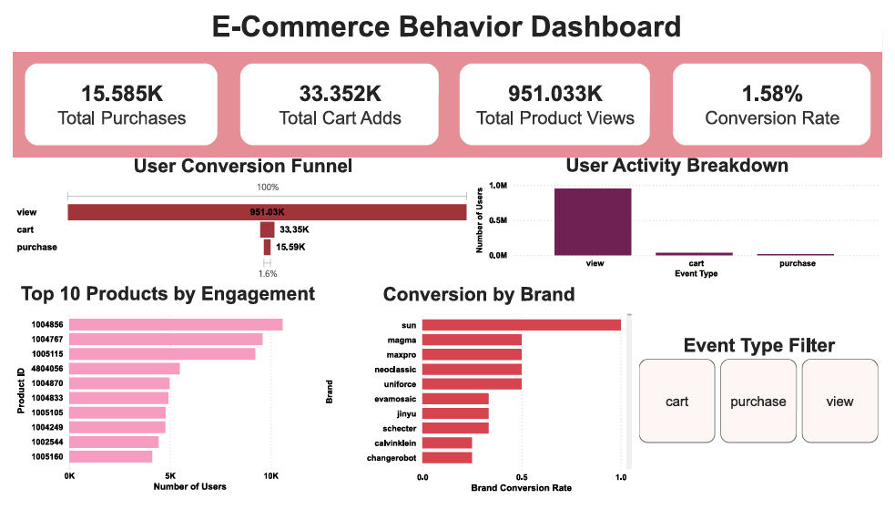
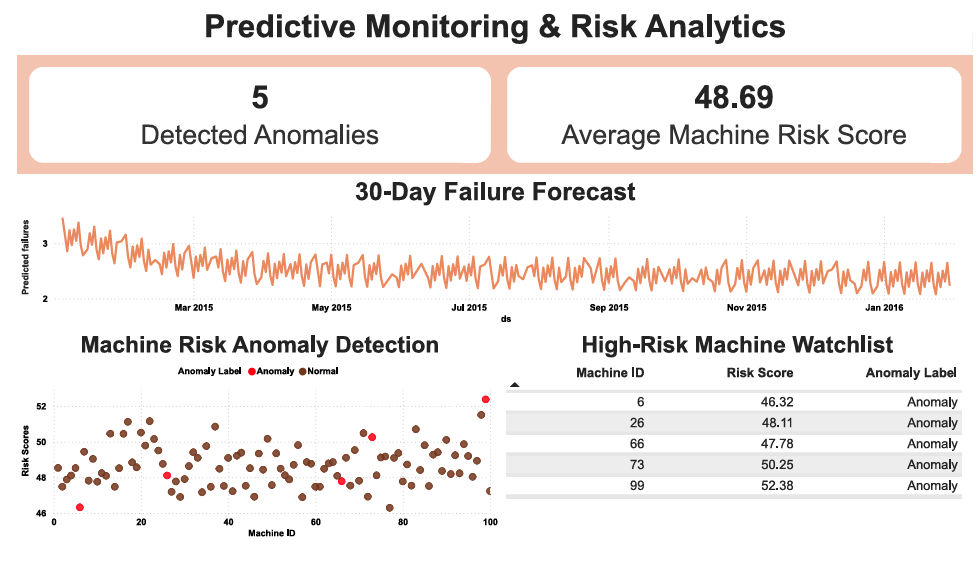

# Operations Analytics & Risk Monitoring Platform

## Overview

This project combines operational, customer behavior, and business transaction data into a unified analytics platform built with Python, PostgreSQL, SQL, and Power BI.

The goal is to create an end-to-end analytics workflow that incorporates feature engineering, forecasting, anomaly detection, and statistical analysis.

The platform integrates data from three different datasets:

* Azure Predictive Maintenance
* Ecommerce Customer Behavior
* Superstore Sales

The data is cleaned and transformed using Python, stored in PostgreSQL, analyzed with SQL, and presented through interactive Power BI dashboards.

In addition to traditional business intelligence reporting, the project includes machine risk scoring, operational failure forecasting, anomaly detection, and hypothesis testing to support data-driven decision-making.

## Architecture



## Datasets
### Azure Predictive Maintenance
Operational telemetry and maintenance data used for machine monitoring and risk analysis.

Key data includes:

* Telemetry measurements
* Machine failures
* Error events
* Maintenance records

### Ecommerce Customer Behavior

Customer interaction data containing:

* Product views
* Cart additions
* Purchases
* User sessions

It is used for funnel and conversion analysis.

### Superstore Sales

Business transaction dataset containing:

* Orders
* Customers
* Products
* Sales
* Profit

It is used for executive reporting and profitability analysis.

## Project Structure
```
operations_analytics_and_risk_monitoring/

assets/
dashboard_screenshots/
data/
    raw/
    processed/
powerbi/
reports/
sql/
src/
    preprocessing/
    features/
    database/
    models/
README.md
requirements.txt
.gitignore
.env.example

```

## Data Processing
### Data Cleaning

Data cleaning pipelines were implemented separately for each dataset.

Tasks include:

* Datetime standardization
* Duplicate removal
* Missing value handling
* Column normalization

Files:
```
src/preprocessing/clean_superstore.py
src/preprocessing/clean_ecommerce.py
src/preprocessing/clean_azure.py
```

## Feature Engineering

Additional features were created from machine telemetry and maintenance data.

Examples include:

* Average Voltage
* Average Rotation
* Average Pressure
* Average Vibration
* Failure Count
* Maintenance Count
* Machine Risk Score

Example risk score calculation:

risk_score = (
    avg_vibration * 0.4 +
    avg_pressure * 0.3 +
    failure_count * 0.3
)

Output:
`data/processed/machine_features.csv`

## PostgreSQL Data Warehouse

Processed datasets are loaded into PostgreSQL using SQLAlchemy.

Tables:

* superstore_orders
* ecommerce_events
* machines
* telemetry
* failures
* errors
* maintenance
* machine_features

The database serves as the central layer for SQL analytics and Power BI reporting.


## SQL Analytics

SQL queries were developed to support both operational and business analysis.

Examples include:

* Total sales and profit
* Regional performance analysis
* Category profitability
* Ecommerce funnel metrics
* Brand engagement analysis
* Failure frequency analysis
* Machine risk metrics

File:

`sql/analytics_queries.sql`


## Forecasting

Failure forecasting was implemented using Prophet.

File:

`src/models/forecasting.py`

Workflow:

1. Aggregate daily machine failures
2. Train forecasting model
3. Generate 30-day forecast
4. Export forecast outputs

Outputs:
```
reports/failure_forecast.csv
reports/failure_forecast.png
```
## Anomaly Detection

Anomaly detection was implemented using Isolation Forest.

File:

`src/models/anomaly_detection.py`

Input features:

* Average Voltage
* Average Rotation
* Average Pressure
* Average Vibration

Outputs:
```
reports/anomaly_results.csv
reports/anomaly_plot.png
```
The model identifies machines with unusual operating conditions that may require additional investigation.

## Statistical Analysis

A two-sample t-test was performed to compare vibration levels between normal and anomalous machines.

File:

`src/models/statistical_analysis.py`

Result:

P-value = 0.913

The analysis did not find a statistically significant difference in vibration levels alone, suggesting that anomaly detection was driven by a combination of telemetry variables rather than a single measurement.

Output:

`reports/statistical_analysis_results.txt`

## Power BI Dashboards

### Executive Business Dashboard



### Operations Analytics Dashboard



### Ecommerce Behavior Dashboard



### Predictive Monitoring Dashboard



## Key Insights

While building the dashboards and analytics pipeline, several patterns emerged across the business, ecommerce, and operational datasets.

* The business data showed approximately $2.3M in total sales and $286K in profit, resulting in a profit margin of about 12.5%. Performance varied noticeably across regions and product categories, highlighting areas with stronger profitability than others.
* Customer behavior data revealed a significant drop-off between product views and completed purchases. With an overall conversion rate of roughly 1.6%, the results suggest that small improvements in the purchase funnel could have a meaningful impact on overall conversions.
* Analysis of the Azure maintenance dataset identified 761 machine failures across different machine models and components. Monitoring these failures alongside telemetry metrics provided additional visibility into operational risk.
* Machine-level risk scores were created using telemetry measurements and historical failure information, allowing machines to be ranked and monitored based on potential operational risk.
* The anomaly detection model flagged 5 machines with unusual operating patterns. These machines may warrant additional investigation and demonstrate how anomaly detection can help focus maintenance efforts on the most critical assets.
* Failure forecasting provided a forward-looking view of expected machine failures, illustrating how predictive analytics can support proactive maintenance planning rather than relying solely on historical reporting.
* Statistical testing showed that vibration levels alone were not significantly different between anomalous and normal machines. This suggests that unusual machine behavior is better explained by a combination of telemetry variables rather than any single measurement.

## Technology Used 

### Programming
* Python
  
### Data Processing
* Pandas
* NumPy
  
### Database
* PostgreSQL
* SQLAlchemy
* Psycopg2
  
### Analytics & Machine Learning
* SQL
* Scikit-Learn
* Prophet
* SciPy
  
### Visualization
* Power BI
* Matplotlib


## Running the Project

Install dependencies:

`pip install -r requirements.txt`

Run the full analytics pipeline:

`python src/run_pipeline.py`

Stages:

*  Cleaning
*  Feature Engineering
*  PostgreSQL Loading
*  Forecasting
*  Anomaly Detection
*  Statistical Analysis


